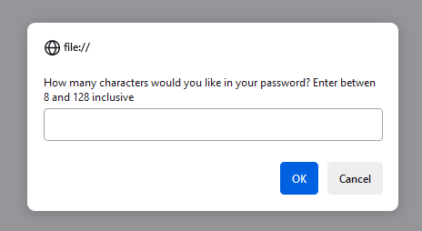
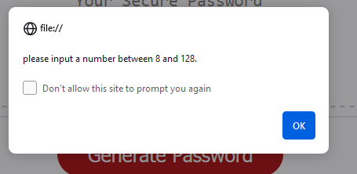
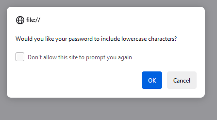
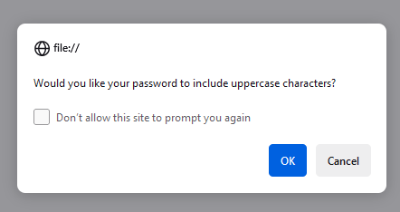
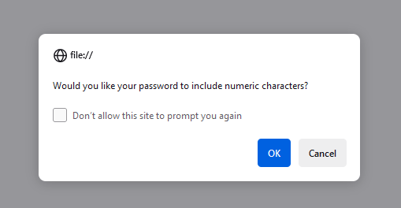
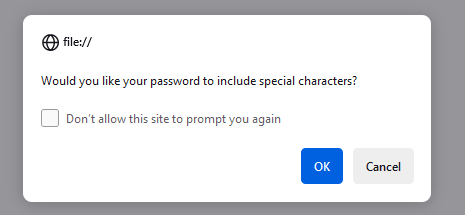

## Bootcamp-Password-Generator

## Overview 

### Bootcamp Password Generator is an application that an employee can use to generate a random password based on criteria they've selected by modifying starter code. This app will run in the browser, and will feature dynamically updated HTML and CSS powered by JavaScript code tht you write. It will have a clean and polished user interface that is responsive, ensuring that itadapts to multiple screen sizes.

The password can include special characters. If you’re unfamiliar with these, see this [list of Password Special Characters from the OWASP Foundation](https://www.owasp.org/index.php/Password_special_characters).

## Contents

### Instructions

### Installation
### Credits

## Instructions

The following image shows the web application's appearance and functionality:

* Generate a password when the button is clicked
  * Present a series of prompts for password criteria
    * Length of password
      * At least 8 characters but no more than 128.

        
      
      * Error Message should appear if  less than8 characters is selected

        

    * Character types

    * Lowercase

      

    * Uppercase 

      
 
    * Numeric
   
      

    * Special characters ($@%&*, etc)
   
      
    
  * Code should validate for each input and at least one character type should be selected
  
  * Once prompts are answered then the password should be generated and displayed in an alert or written to the page

  ## Grading Requirements

This challenge is graded based on the following criteria: 

### Technical Acceptance Criteria: 40%

* Satisfies all of the above acceptance criteria plus the following:

  * The challenge should not produce any errors in the console when you inspect it using Chrome DevTools.

### Deployment: 32%

* Application deployed at live URL.

* Application loads with no errors.

* Application GitHub URL submitted.

* GitHub repository that contains application code.

### Application Quality: 15%

* Application user experience is intuitive and easy to navigate.

* Application user interface style is clean and polished.

* Application resembles the mock-up functionality provided in the challenge instructions.

### Repository Quality: 13%

* Repository has a unique name.

* Repository follows best practices for file structure and naming conventions.

* Repository follows best practices for class/id naming conventions, indentation, quality comments, etc.

* Repository contains multiple descriptive commit messages.

* Repository contains quality README file with description, screenshot, and link to deployed application.

## Review

You are required to submit the following for review:

* The URL of the deployed application.

* The URL of the GitHub repository. Give the repository a unique name and include a README describing the project.

## Installation
   * Go to the deployed site and run the application.

## Credits
   * Tutors Help 

